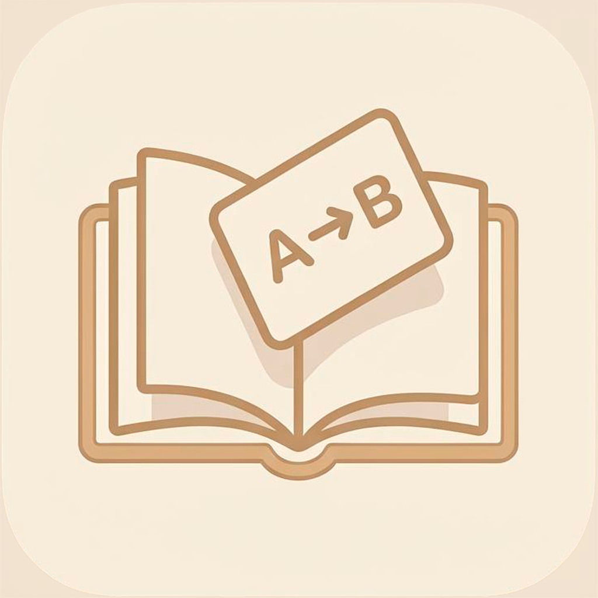
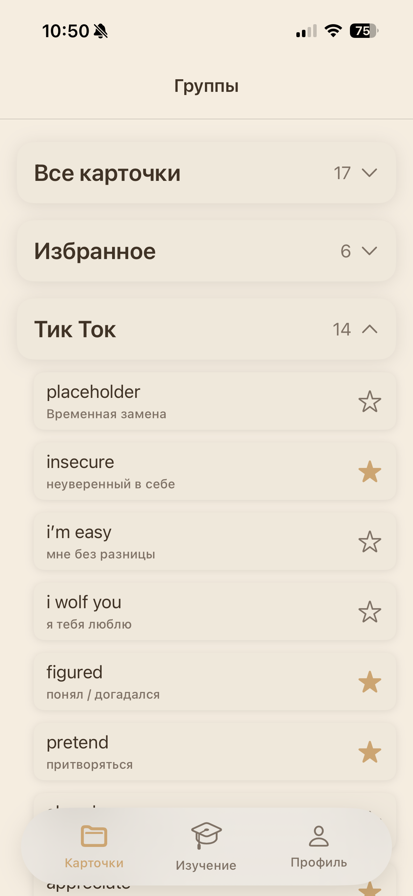
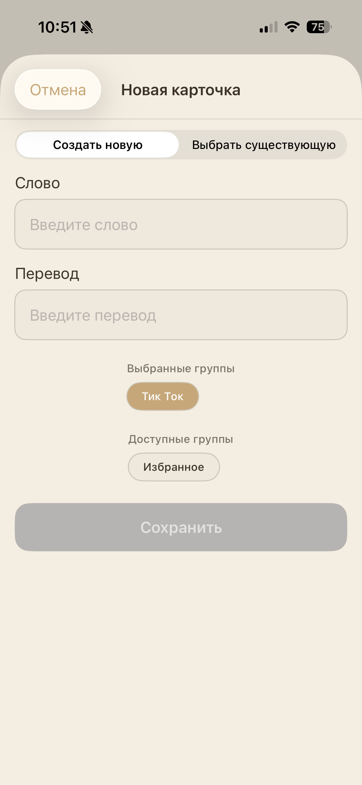
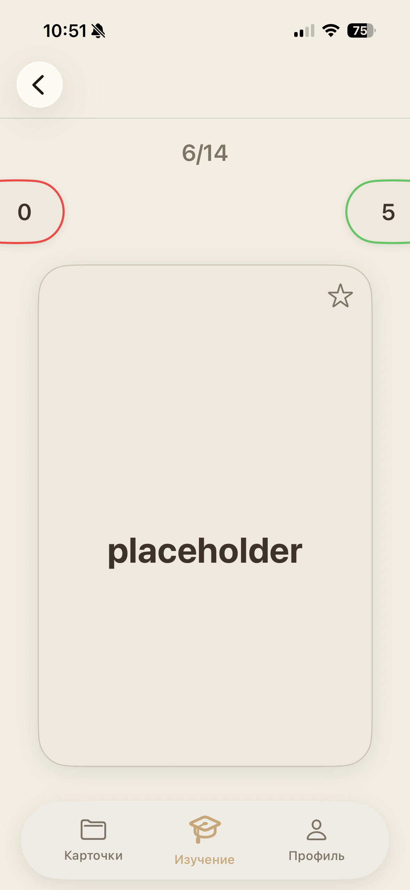
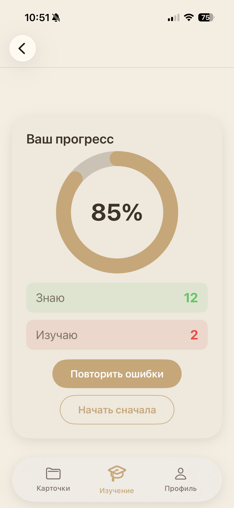
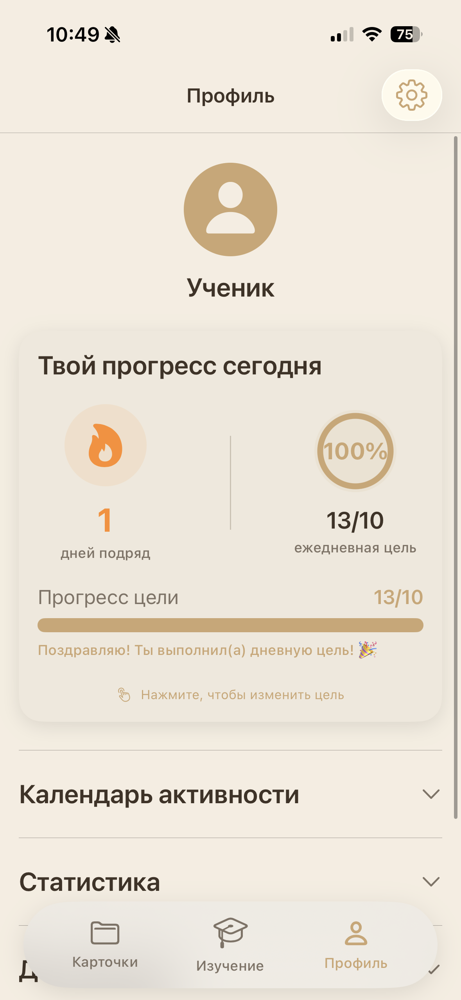
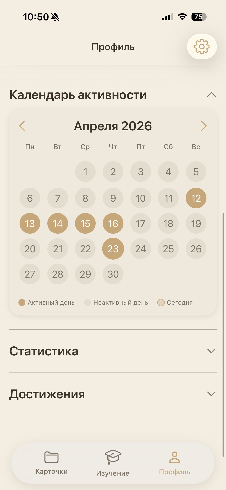
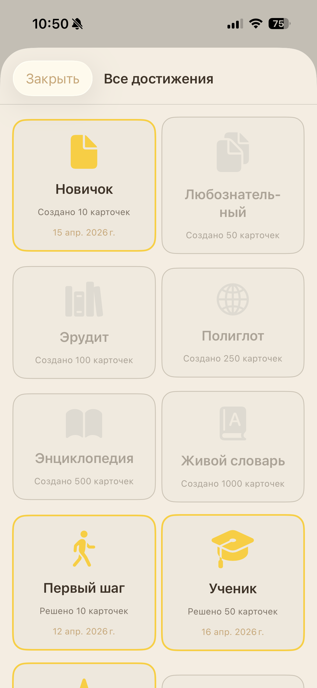
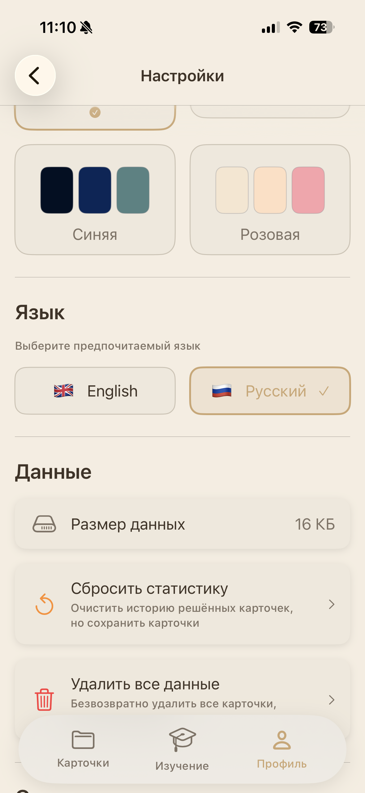

# 📚 English Words

  

  <i>Эффективное изучение английских слов с помощью флеш-карточек</i>

---

## 📱 О приложении

**English Words** — это нативное iOS-приложение для изучения английских слов, построенное полностью на SwiftUI. Приложение помогает эффективно запоминать новую лексику через систему флеш-карточек с отслеживанием прогресса, достижениями и гибкой настройкой.

### ✨ Ключевые особенности

#### 📇 Управление карточками и группами
- **Создание карточек** — добавление собственных слов с переводом
- **Группировка** — организация карточек по тематическим группам
- **Системные группы** — "Все карточки" и "Избранное" для удобной навигации
- **Гибкое редактирование** — изменение слов, переводов и принадлежности к группам
- **Массовое добавление** — выбор существующих карточек для добавления в новую группу

#### 🎯 Режим изучения
- **Интерактивные карточки** — свайп вправо (знаю) / влево (изучаю)
- **Flip-анимация** — переворот карточки для просмотра перевода
- **Умная сессия** — запоминание прогресса и возможность продолжить с места остановки
- **Работа над ошибками** — повторение только тех карточек, которые вызвали затруднение
- **Статистика сессии** — процент правильных ответов и детальная аналитика

#### 📊 Профиль и статистика
- **Календарь активности** — визуализация дней, когда вы занимались
- **Daily Goal** — установка и отслеживание ежедневной цели
- **Streak** — счётчик дней непрерывных занятий
- **Детальная статистика** — общее количество карточек, решённых карточек, избранного

#### 🏆 Система достижений
- **30+ достижений** за создание карточек, решение, ежедневные цели и серии
- **Анимации при разблокировке** — визуальное оповещение о новых достижениях
- **Прогресс-трекинг** — отслеживание прогресса по всем категориям

#### 🎨 Кастомизация
- **4 цветовые темы** — Beige, Green, Blue, Pink
- **Мгновенное переключение** — темы применяются без перезагрузки
- **Тёмная/Светлая тема** — автоматическая адаптация под выбранную палитру
- **Локализация** — полная поддержка Русского и Английского языков

#### ⚙️ Настройки и данные
- **Управление данными** — просмотр размера хранилища
- **Сброс статистики** — очистка прогресса с сохранением карточек
- **Полная очистка** — удаление всех данных с возможностью начать заново
- **История версий** — встроенный экран release notes

---

## 🛠 Технологии и архитектура

### Технологический стек

| Категория | Технологии |
|-----------|------------|
| **UI Framework** | SwiftUI 100% |
| **Язык** | Swift 5.9 |
| **Хранение данных** | FileManager (JSON) + UserDefaults |
| **Архитектура** | MV (Model-View) с Managers |
| **Минимальная версия** | iOS 16.0 |
| **Зависимости** | Отсутствуют (pure Swift) |

## 📚 Документация

- [Технические решения](TECHNICAL.md)

---

### 💾 Сохранение данных

- **Карточки и группы**: JSON-сериализация в Documents Directory
- **Настройки и статистика**: UserDefaults с @AppStorage
- **Кодирование/Декодирование**: Codable с кастомной логикой для ObservableObject

### 🎨 Дизайн-система

- **Динамические цвета** — адаптация под выбранную тему через Environment
- **Кастомные модификаторы** — ThemeAware, LanguageAware для реактивного обновления
- **Переиспользуемые компоненты** — FlowLayout, StatCard, AchievementBadge
- **Анимации** — Spring-анимации для свайпов и переходов

---

## 📸 Скриншоты

  <table>
    <tr>
      <td align="center"><b>Группы</b></td>
      <td align="center"><b>Добавление карточки</b></td>
      <td align="center"><b>Процесс изучения</b></td>
      <td align="center"><b>Результаты</b></td>
    </tr>
    <tr>
      <td></td>
      <td></td>
      <td></td>
      <td></td>
    </tr>
    <tr>
      <td align="center"><b>Профиль</b></td>
      <td align="center"><b>Календарь активности</b></td>
      <td align="center"><b>Достижения</b></td>
      <td align="center"><b>Настройки</b></td>
    </tr>
    <tr>
      <td></td>
      <td></td>
      <td></td>
      <td></td>
    </tr>
  </table>

## 🔮 Планы по развитию

### Версия 1.2.0 (в разработке)
- [ ] Импорт/экспорт карточек (CSV, JSON)
- [ ] iCloud синхронизация
- [ ] Виджеты для домашнего экрана
- [ ] Push-уведомления с напоминаниями

### Версия 2.0.0 (планируется)
- [ ] Миграция на MVVM + Router
- [ ] Онлайн-словарь для быстрого добавления слов
- [ ] Произношение слов (AVSpeechSynthesizer)
