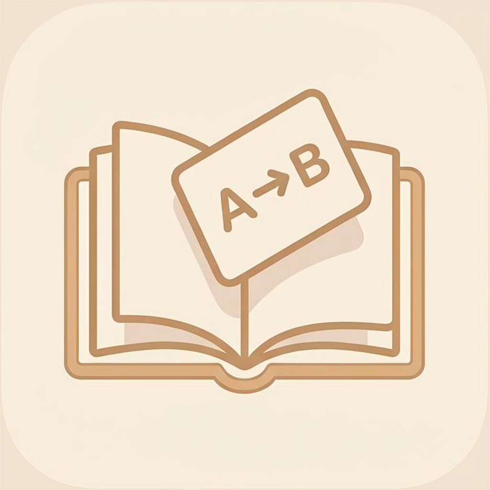
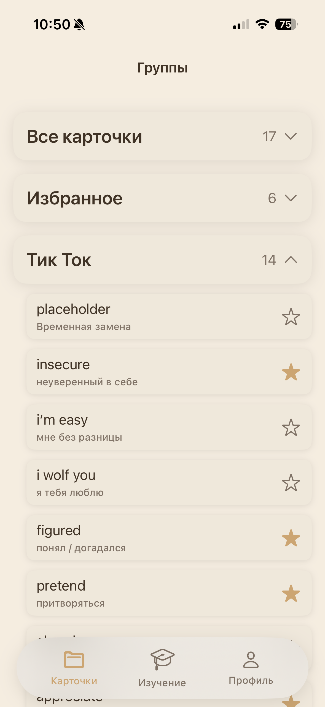
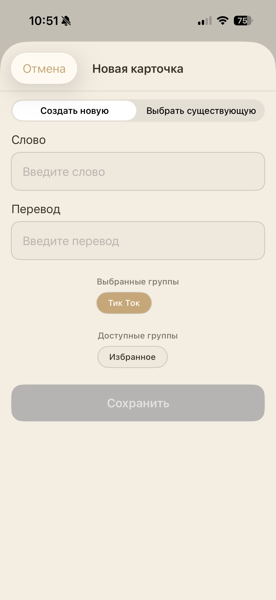
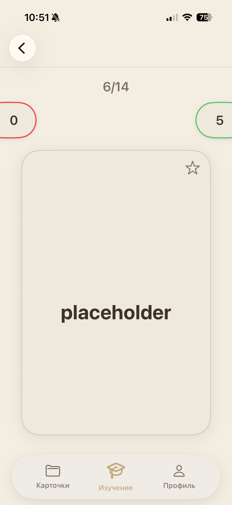
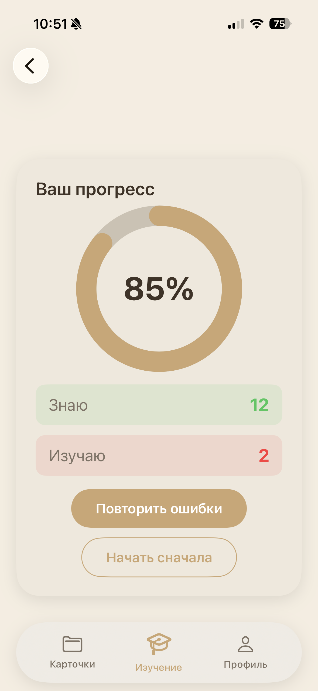
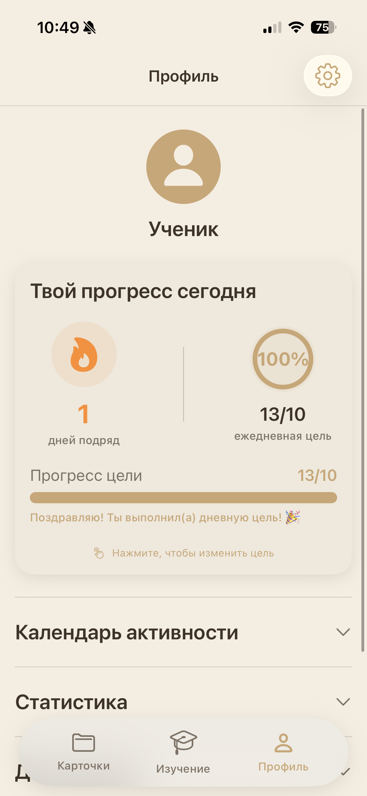
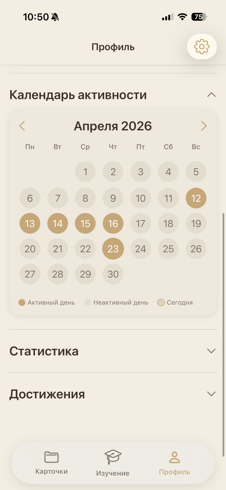
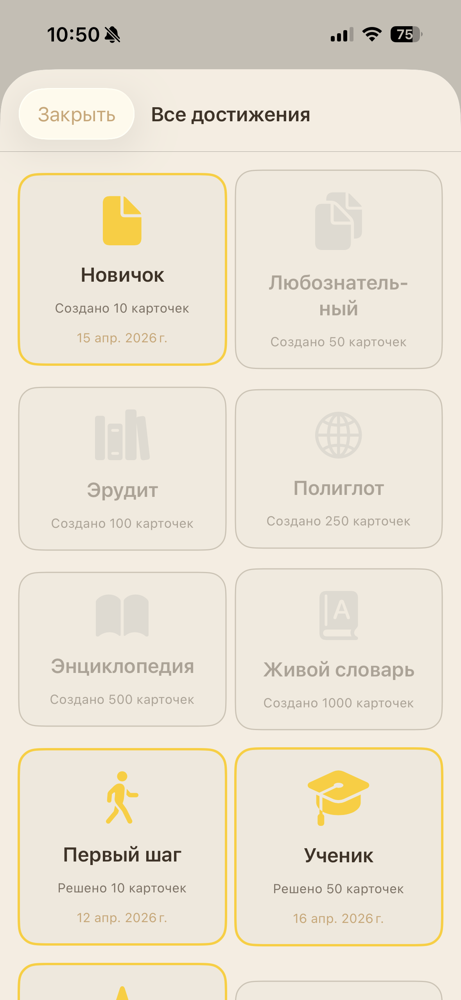
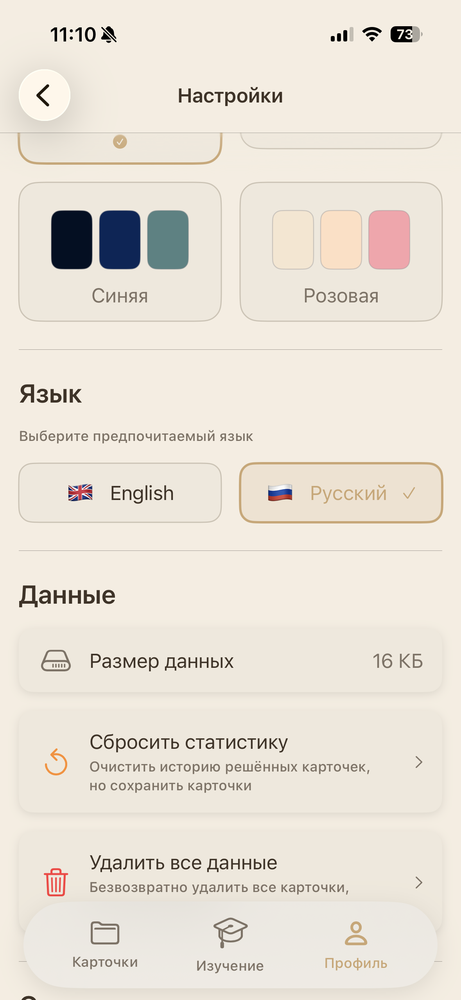

# 📚 English Words

[](https://swift.org)
[](https://developer.apple.com/ios/)
[](https://developer.apple.com/xcode/swiftui/)
[](https://developer.apple.com/xcode/swiftdata/)
[](LICENSE)
[](https://apple.com)

<p align="center">
  
</p>

<p align="center">
  <i>Эффективное изучение английских слов с помощью флеш-карточек и интервального повторения</i>
</p>

---

## 📱 О приложении

**English Words** — это нативное iOS-приложение для изучения английских слов, построенное полностью на SwiftUI. Приложение помогает эффективно запоминать новую лексику через систему флеш-карточек с отслеживанием прогресса, достижениями, гибкой настройкой и **интервальным повторением по методу SM-2**.

### ✨ Ключевые особенности

#### 🧠 Интервальное повторение (SRS)
- **Алгоритм SM-2** — классическая методика SuperMemo для оптимального запоминания
- **Оценка 0–5** — шесть уровней уверенности после просмотра перевода
- **Умное расписание** — интервалы между повторениями рассчитываются индивидуально для каждой карточки
- **Предсказание интервала** — под каждой кнопкой оценки видно, когда карточка вернётся
- **Лимит новых карточек** — настраиваемое количество новых слов в день
- **Ежедневная очередь** — карточки, готовые к повторению, собраны в одном месте

#### 📇 Управление карточками и группами
- **Создание карточек** — добавление собственных слов с переводом
- **Группировка** — организация карточек по тематическим группам
- **Системные группы** — "Все карточки" и "Избранное" для удобной навигации
- **Гибкое редактирование** — изменение слов, переводов и принадлежности к группам
- **Массовое добавление** — выбор существующих карточек для добавления в новую группу

#### 🎯 Режимы изучения
- **Свободный режим** — свайп вправо (знаю) / влево (изучаю) для быстрой практики
- **SRS-режим** — карточка переворачивается, вы оцениваете качество запоминания по шкале 0–5
- **Flip-анимация** — переворот карточки для просмотра перевода
- **Умная сессия** — запоминание прогресса и возможность продолжить с места остановки
- **Работа над ошибками** — повторение только тех карточек, которые вызвали затруднение

#### 📊 Профиль и статистика
- **Календарь активности** — визуализация дней, когда вы занимались
- **Daily Goal** — установка и отслеживание ежедневной цели
- **Streak** — счётчик дней непрерывных занятий
- **Детальная статистика** — общее количество карточек, решённых карточек, избранного

#### 🏆 Система достижений
- **30+ достижений** за создание карточек, решение, ежедневные цели и серии
- **Анимации при разблокировке** — визуальное оповещение о новых достижениях
- **Прогресс-трекинг** — отслеживание прогресса по всем категориям

#### 🎨 Кастомизация
- **4 цветовые темы** — Beige, Green, Blue, Pink
- **Мгновенное переключение** — темы применяются без перезагрузки
- **Тёмная/Светлая тема** — автоматическая адаптация под выбранную палитру
- **Локализация** — полная поддержка Русского и Английского языков

#### ⚙️ Настройки и данные
- **Управление данными** — просмотр размера хранилища
- **Сброс статистики** — очистка прогресса с сохранением карточек
- **Полная очистка** — удаление всех данных с возможностью начать заново
- **История версий** — встроенный экран release notes

---

## 🛠 Технологии и архитектура

### Технологический стек

| Категория | Технологии |
|-----------|------------|
| **UI Framework** | SwiftUI 100% |
| **Язык** | Swift 5.9+ |
| **Хранение данных** | SwiftData + UserDefaults |
| **Архитектура** | MVVM + Repository + DI |
| **Минимальная версия** | iOS 17.0 |
| **Зависимости** | Отсутствуют (pure Swift + Apple frameworks) |

### 🏗 Архитектура

Приложение построено на **MVVM + Repository** с чётким разделением слоёв и внедрением зависимостей через `AppContainer`.

```
┌──────────────────────────────────────────────────┐
│                    SwiftUI View                  │
│  Рендер + @State для UI + Intents (методы VM)    │
└──────────────────────┬───────────────────────────┘
                       │
┌──────────────────────▼───────────────────────────┐
│              @Observable ViewModel               │
│  Состояние экрана • Валидация • Навигация        │
└──────────────────────┬───────────────────────────┘
                       │
┌──────────────────────▼───────────────────────────┐
│                   Repositories                   │
│  CardRepository • GroupRepository • StatsRepo    │
│  Единственное место с ModelContext               │
└──────────────────────┬───────────────────────────┘
                       │
┌──────────────────────▼───────────────────────────┐
│                     SwiftData                    │
│  @Model Card • CardGroup • DailyStat • Settings  │
└──────────────────────────────────────────────────┘
```

**Ключевые принципы:**
- **AppContainer** — единый DI-контейнер, собранный один раз в точке входа
- **Репозитории** — изолируют SwiftData, все мутации идут через них
- **@Observable ViewModel** — один на экран, зависимости через `init`
- **Services** — `AchievementsService`, `SolveSessionCoordinator`, `SRSAlgorithm` — чистая логика поверх репозиториев
- **Отсутствие синглтонов** для бизнес-логики (синглтоны остались только для UI-инфраструктуры — темы и языка)

### 💾 Сохранение данных

- **Карточки и группы**: SwiftData (SQLite под капотом), `@Model` с автоматической миграцией
- **Статистика и достижения**: SwiftData (`UserSettings`, `DailyStat`)
- **Сессии нарешивания**: UserDefaults (JSON) — эфемерное состояние, не в основной БД
- **UI-настройки**: `@AppStorage` — тема, язык, лимит новых карточек

### 🧮 SRS-алгоритм

- **Классический SM-2** — `easeFactor`, `intervalDays`, `repetitions`, `nextReviewDate` на каждой карточке
- **Чистая математика** — `SRSAlgorithm` не зависит от SwiftData и тестируется изолированно
- **Оценка 0–5** — полный диапазон SM-2 без упрощений
- **Автоматическая миграция** — старые карточки получают дефолтные SRS-поля

### 🎨 Дизайн-система

- **Динамические цвета** — адаптация под выбранную тему через `ThemeManager`
- **Семантические extension'ы** — `Color.appBackground`, `.textPrimary`, `.accent`
- **Переиспользуемые компоненты** — `FlowLayout`, `StatCard`, `AchievementBadge`, `SRSDueCard`
- **Анимации** — Spring-анимации для свайпов, переворотов и переходов

---

## 📸 Скриншоты

<p align="center">
  <table>
    <tr>
      <td align="center"><b>Группы</b></td>
      <td align="center"><b>Добавление карточки</b></td>
      <td align="center"><b>Свободный режим</b></td>
      <td align="center"><b>Результаты</b></td>
    </tr>
    <tr>
      <td></td>
      <td></td>
      <td></td>
      <td></td>
    </tr>
    <tr>
      <td align="center"><b>Профиль</b></td>
      <td align="center"><b>Календарь активности</b></td>
      <td align="center"><b>Достижения</b></td>
      <td align="center"><b>Настройки</b></td>
    </tr>
    <tr>
      <td></td>
      <td></td>
      <td></td>
      <td></td>
    </tr>
  </table>
</p>

---

## 🗺 История версий

### v2.0.0 — текущая
- ✨ Добавлено интервальное повторение (SRS, алгоритм SM-2) для эффективного запоминания
- 🏗 Полностью переписана архитектура приложения: MVVM + Repository + DI, хранение на SwiftData

### v1.1.1 и раньше
- См. встроенный экран **История изменений** в приложении

---

## 🔮 Планы по развитию

### Ближайшее
- [ ] Импорт/экспорт карточек (CSV, JSON)
- [ ] iCloud синхронизация через CloudKit
- [ ] Виджеты для домашнего экрана
- [ ] Push-уведомления с напоминаниями
- [ ] Бейдж на таб "Изучение" с количеством карточек к повторению

### В перспективе
- [ ] Онлайн-словарь для быстрого добавления слов
- [ ] Произношение слов (AVSpeechSynthesizer)
- [ ] Дополнительные режимы тренировки: множественный выбор, ввод перевода
- [ ] Статистика SRS — распределение карточек по интервалам

---

## 📄 Лицензия

Этот проект распространяется под лицензией MIT.

---

## 👨‍💻 Автор

**Георгий Халиков**

- Telegram: [@DERAPTER](https://t.me/DERAPTER)

---

<p align="center">
  <i>Сделано с ❤️ на SwiftUI</i>
</p>
